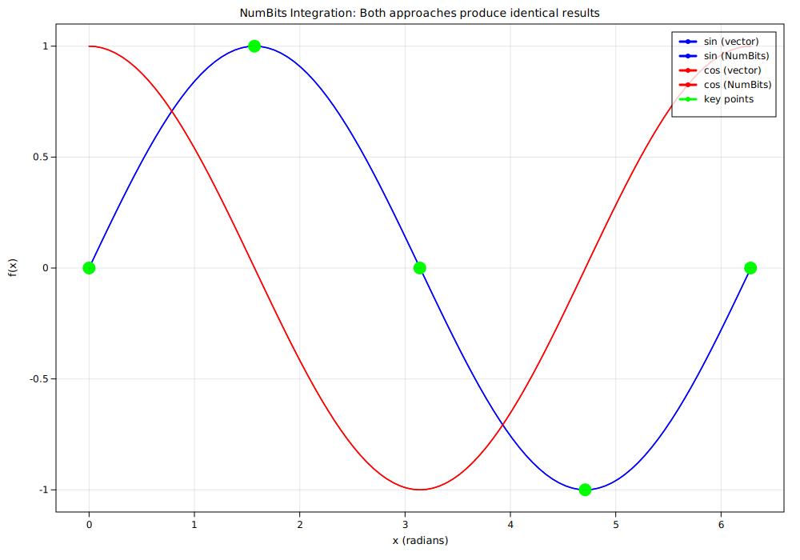

# Catplotlib (C++ mini-plotting, matplotlib-like)

Catplotlib is a lightweight, header-first C++ plotting library that renders to SVG. It provides a tiny, familiar API reminiscent of matplotlib for quick plots directly from C++ without external runtime dependencies.

---

## Features (v0.1)

- Line plots and scatter plots
- Automatic axis limits and nice ticks
- Title, x-label, y-label
- Pure C++17, outputs an SVG file
- Grid and legend toggles (basic)
- Multiple subplots (`subplot(nrows, ncols, index)`)

## Planned Features

- PNG export
- Dear ImGui/SDL interactive backend
- Improved text rendering with font metrics
- Enhanced multi-axes layouts
- Advanced legend and grid customization
- More plot types (bar, histogram, etc.)
- Better error handling and validation
- Documentation improvements
- Performance optimizations
- Additional examples and tutorials

---

## Build

Requirements:

- CMake 3.15+
- A C++17 compiler (MSVC, clang, or gcc)

Steps:

```bash
cmake -S . -B build
cmake --build build --config Release
```

This builds the `catplotlib` library and the example `catplot_example`.

## Run the example

```bash
# After building as above
cd build
./catplot_example   # on Windows: .\\Release\\catplot_example.exe (multi-config generators)
```

It produces `catplot_example.svg` in the working directory.

## Basic usage

```cpp
#include "catplot/catplot.hpp"
#include <vector>

int main() {
    using namespace catplot;
    Figure fig(800, 600);
    auto& ax = fig.axes();

    std::vector<double> x{0, 1, 2, 3};
    std::vector<double> y{0, 1, 0, 1};

    ax.plot(x, y, Rgba::Blue(), 2.0);
    ax.scatter(x, y, 4.0, Rgba::Red());
    ax.set_title("Hello catplot");
    ax.set_xlabel("x");
    ax.set_ylabel("y");
    ax.grid(true);
    ax.legend(true); // requires series with labels

    fig.save("out.svg");
}
```

---

## API overview

- `Figure(int widthPx = 800, int heightPx = 600)`
- `Axes& Figure::axes()`
- `Axes& Figure::subplot(int nrows, int ncols, int index1based)`
- `void Axes::plot(const std::vector<double>& x, const std::vector<double>& y, const Rgba& color, double lineWidthPx)`
- `void Axes::plot(..., const std::string& label)` (optional)
- `void Axes::scatter(const std::vector<double>& x, const std::vector<double>& y, double radiusPx, const Rgba& color)`
- `void Axes::scatter(..., const std::string& label)` (optional)
- `void Axes::set_title(const std::string&)`, `set_xlabel`, `set_ylabel`
- `void Axes::grid(bool)`, `void Axes::legend(bool)`
- `void Figure::save(const std::string& path)` -> SVG
- `void Figure::save_png(const std::string& path)` -> Not yet implemented (stub)

## Example Gallery

Here are some example plots generated with catplot:





> [!NOTE]
>
> - `NumBits` I use in this is my own lightweight number computation library like mini numpy but in cpp.
> - SVG text rendering uses browser defaults (sans-serif). There is no font metrics; label placement is approximate but readable.
> - For multi-axes layouts, legends, grid, and styles, contributions are welcome.
> - PNG export and Dear ImGui/SDL interactive backend are on the roadmap. The `save_png` API exists as a stub and currently throws.

---

## License

[MIT](https://github.com/Iro96/catplotlib/blob/main/LICENSE)

